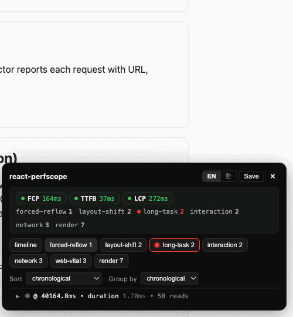
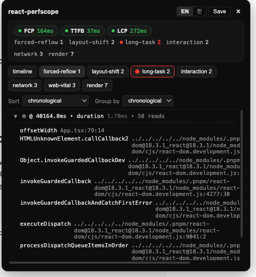
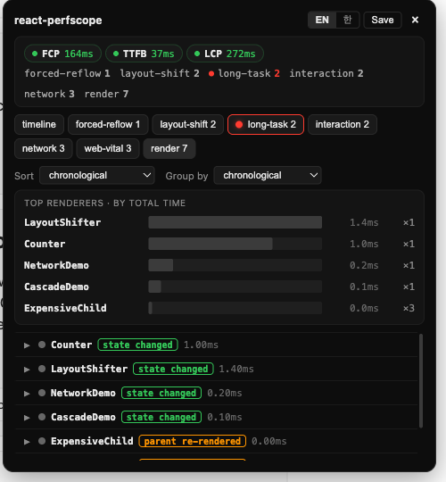

# react-perfscope


Performance debugging tool for React 18+ apps. Records forced reflows, layout shifts, long tasks, web vitals, network requests, interactions, and React component renders during development — and visualises them in a floating UI panel.



## Quickstart

The one-line install for Vite users:

```sh
npm install -D @react-perfscope/vite react-perfscope
```

```ts
// vite.config.ts
import { defineConfig } from 'vite'
import react from '@vitejs/plugin-react'
import reactPerfscope from '@react-perfscope/vite'

export default defineConfig({
  plugins: [reactPerfscope(), react()],
})
```

Start the dev server. A floating "rec" button appears in the bottom-right. Click it, interact with your app, click it again — a per-signal-kind panel opens with everything recorded.

Webpack users use `@react-perfscope/webpack` instead — see its README.

**Next.js** (App Router, Next 15.3+) needs no plugin — add an `instrumentation-client.ts` at your project root; it works under both Turbopack and webpack:

```ts
// instrumentation-client.ts
import 'react-perfscope/auto'
```

Optionally enable long-task hot-function attribution by sending the `Document-Policy: js-profiling` header:

```ts
// next.config.ts
export default {
  async headers() {
    return [{ source: '/:path*', headers: [{ key: 'Document-Policy', value: 'js-profiling' }] }]
  },
}
```

If you'd rather wire it manually, install `react-perfscope` and add `import 'react-perfscope/auto'` at the **very top** of your entry file (before `react-dom` is imported).

## Demo

Stop a recording and the panel groups everything by signal kind. Two of the tabs:

| Forced reflow — source-mapped call stack | Render — top renderers and why they re-rendered |
|---|---|
|  |  |

Each forced reflow is traced to the line that triggered it (`offsetWidth` at `App.tsx:79`), and every render is tagged with its reason (`state changed` vs `parent re-rendered`) so avoidable cascades stand out.

See `examples/vite-react` for a runnable Vite + React demo.

## Packages

This is a pnpm monorepo. Six published packages:

| Package | Description |
|---|---|
| [`react-perfscope`](./packages/meta) | Meta. Re-exports core/react/ui + `react-perfscope/auto` side-effect bootstrap |
| [`@react-perfscope/core`](./packages/core) | Recorder + collectors (forced-reflow, layout-shift, long-task, network, web-vital, interaction, heap, frame) + sourcemap utilities |
| [`@react-perfscope/react`](./packages/react) | React 18+ adapter: DevTools global hook, fiber walker, attribution, render collector |
| [`@react-perfscope/ui`](./packages/ui) | Preact + Shadow DOM widget, per-kind tabbed panel, DOM overlay |
| [`@react-perfscope/vite`](./packages/vite-plugin) | Vite plugin: auto-inject in dev |
| [`@react-perfscope/webpack`](./packages/webpack-plugin) | Webpack plugin: auto-inject in dev |

## Status

Published on npm (`0.6.0`). Compatible with React 18 & 19, Vite 5–8, webpack 5, and Next.js (App Router). Production-safe: the auto bootstrap bails when `NODE_ENV === 'production'`, and the build plugins are no-ops outside dev.

## Does it skew the numbers it reports?

react-perfscope instruments in-band — it runs on the same main thread as your code — so its own cost can't simply be subtracted out afterward. Instead the design keeps that cost low enough to ignore, and excludes the tool's own activity from the results. Some measurements (headless Chromium, the `examples/vite-react` app; indicative, not guarantees):

- **Idle is silent.** Recording an idle app for a few seconds produces zero forced-reflow / render / layout-shift / long-task / network signals — only genuine web vitals. There is no phantom noise floor from the tool itself.
- **Forced reflow.** On a pathological layout-thrash loop — 5,000 reads where *every* read forces a synchronous layout — recording added roughly **1–2µs per read** (~30ms → ~38ms). Real code forces layout far less often, so the real-world cost is much smaller. All reads in one synchronous turn are coalesced into a single signal, so the call stack is captured **once per turn**, not per read.
- **React renders.** Per commit the collector adds about **0.01ms** for a typical commit (a handful of components). Even a pathological re-render of **800 components** costs about **0.5ms**, because the whole commit is coalesced into one signal (down from ~6ms before per-commit coalescing landed in 0.3.0).
- **The tool excludes itself.** Its own stack frames are filtered out of long-task hot-function attribution, and its own network requests (source-map fetches) are dropped from network signals — so you never see react-perfscope blamed for your app's time.
- **Layout shifts aren't CLS.** The list includes input-driven shifts that the CLS metric excludes — so you can see what your own interactions moved, rather than a CLS score.

These numbers track the browser's own measurements closely: long-task / INP / layout-shift values come from the same native Performance APIs that Chrome DevTools and `web-vitals` read, and per-commit render durations match React's Profiler.

And none of this ships to production: the auto bootstrap and build plugins disable themselves outside dev.

## Development

```sh
pnpm install
pnpm test          # vitest, 275 tests
pnpm typecheck     # tsc --noEmit per package
pnpm build         # tsup per package (filtered to packages/*)
pnpm api:check     # fail if the public API surface drifted from its snapshot
pnpm api:update    # accept a deliberate API change into the snapshot
```

Real-browser verification harness (Playwright + headless Chromium) — checks
recorded signals against the native Performance APIs to verify accuracy,
host-app safety, and idle silence:

```sh
pnpm build
pnpm --filter @react-perfscope-e2e/harness exec playwright install chromium
pnpm --filter @react-perfscope-e2e/harness test
pnpm --filter @react-perfscope-e2e/harness report:overhead   # reproduce overhead numbers
```

## Contributing

If react-perfscope is useful to you, a ⭐ on [GitHub](https://github.com/rayforvideos/react-perfscope) genuinely helps the project grow. Bug reports, feature ideas, and PRs are all very welcome — open an [issue](https://github.com/rayforvideos/react-perfscope/issues) to start.

## License

MIT.

---

<a id="한국어"></a>

# 한국어

React 18+ 앱용 성능 디버깅 도구. 개발 중에 강제 리플로우, 레이아웃 시프트, 롱 태스크, 웹 바이탈, 네트워크 요청, 인터랙션, React 컴포넌트 렌더를 기록하고 플로팅 UI 패널로 시각화합니다.

## 빠르게 시작하기

Vite 사용자의 한 줄 설치:

```sh
npm install -D @react-perfscope/vite react-perfscope
```

```ts
// vite.config.ts
import { defineConfig } from 'vite'
import react from '@vitejs/plugin-react'
import reactPerfscope from '@react-perfscope/vite'

export default defineConfig({
  plugins: [reactPerfscope(), react()],
})
```

dev 서버를 띄우면 화면 오른쪽 아래에 떠있는 "rec" 버튼이 보입니다. 클릭하고, 앱을 만지작거리다가, 다시 클릭하면 — 종류별 탭 패널이 열리고 기록된 신호가 전부 표시됩니다.

Webpack 사용자는 `@react-perfscope/webpack`을 쓰세요 — 해당 README 참고.

**Next.js** (App Router, Next 15.3+)는 플러그인이 필요 없습니다 — 프로젝트 루트에 `instrumentation-client.ts`를 만들어 import 한 줄만 넣으면 Turbopack·webpack 모두에서 동작합니다:

```ts
// instrumentation-client.ts
import 'react-perfscope/auto'
```

롱 태스크 핫펑션 귀속까지 켜려면 `Document-Policy: js-profiling` 헤더를 보내세요 (선택):

```ts
// next.config.ts
export default {
  async headers() {
    return [{ source: '/:path*', headers: [{ key: 'Document-Policy', value: 'js-profiling' }] }]
  },
}
```

수동으로 연결하고 싶다면, `react-perfscope`를 설치하고 entry 파일 **가장 맨 위에** `import 'react-perfscope/auto'`를 넣으세요 (`react-dom` import보다 먼저).

## 데모

녹화를 멈추면 패널이 신호 종류별로 정리해서 보여줍니다. 탭 두 개 예시:

| 강제 리플로우 — 소스맵된 콜 스택 | 렌더 — 상위 렌더러와 리렌더 이유 |
|---|---|
|  |  |

강제 리플로우는 그걸 유발한 줄(`App.tsx:79`의 `offsetWidth`)까지 추적되고, 모든 렌더에는 이유(`state changed` vs `parent re-rendered`)가 붙어서 피할 수 있었던 캐스케이드가 눈에 띕니다.

`examples/vite-react`에 실행 가능한 Vite + React 데모가 있습니다.

## 패키지 구성

pnpm 모노레포입니다. 6개 published 패키지:

| 패키지 | 설명 |
|---|---|
| [`react-perfscope`](./packages/meta) | 메타. core/react/ui를 re-export하고 `react-perfscope/auto` 부트스트랩 제공 |
| [`@react-perfscope/core`](./packages/core) | Recorder + collector (forced-reflow, layout-shift, long-task, network, web-vital, interaction, heap, frame) + sourcemap 유틸 |
| [`@react-perfscope/react`](./packages/react) | React 18+ 어댑터: DevTools 글로벌 훅, fiber walker, attribution, render collector |
| [`@react-perfscope/ui`](./packages/ui) | Preact + Shadow DOM 위젯, 종류별 탭 패널, DOM 오버레이 |
| [`@react-perfscope/vite`](./packages/vite-plugin) | Vite 플러그인: dev 자동 주입 |
| [`@react-perfscope/webpack`](./packages/webpack-plugin) | Webpack 플러그인: dev 자동 주입 |

## 상태

npm 게시됨 (`0.6.0`). React 18·19, Vite 5–8, webpack 5, Next.js(App Router) 호환. 프로덕션 안전성: `NODE_ENV === 'production'`이면 auto 부트스트랩이 자동으로 빠지고, 빌드 플러그인도 dev 모드 외에는 no-op입니다.

## 측정 자체를 왜곡하지 않나요?

react-perfscope는 인-밴드로 계측합니다 — 사용자 코드와 같은 메인 스레드에서 돌기 때문에, 도구 자신의 비용을 사후에 단순히 빼낼 수 없습니다. 그래서 그 비용을 무시할 수 있을 만큼 낮게 유지하고, 도구 자신의 활동은 결과에서 제외하는 방향으로 설계했습니다. 실측치 일부 (헤드리스 Chromium, `examples/vite-react` 앱 기준 — 보장이 아니라 참고용):

- **유휴 상태는 조용합니다.** 아무 조작 없이 몇 초 녹화하면 forced-reflow / render / layout-shift / long-task / network 신호가 0건이고, 진짜 web vitals만 잡힙니다. 도구가 만들어내는 노이즈 바닥이 없습니다.
- **강제 리플로우.** 모든 읽기가 동기 레이아웃을 강제하는 병적인 thrash 루프(읽기 5,000회)에서 녹화는 **읽기당 약 1–2µs**를 더했습니다 (~30ms → ~38ms). 실제 코드는 레이아웃을 훨씬 덜 강제하므로 실사용 비용은 훨씬 작습니다. 한 동기 턴의 모든 읽기는 한 신호로 합쳐지므로 콜 스택은 **턴당 1회만** 캡처합니다 (읽기마다가 아님).
- **React 렌더.** 일반 커밋(컴포넌트 몇 개)은 커밋당 약 **0.01ms**를 더합니다. 병적으로 **800개 컴포넌트**가 리렌더되는 커밋도 약 **0.5ms**인데, 커밋 전체가 한 신호로 합쳐지기 때문입니다 (0.3.0의 커밋당 코얼레싱 전에는 ~6ms였음).
- **도구는 자기 자신을 제외합니다.** long-task 핫펑션 attribution에서 도구 자신의 스택 프레임을 걸러내고, 도구 자신의 네트워크 요청(소스맵 fetch)도 network 신호에서 제외합니다 — 그래서 앱의 시간이 react-perfscope 탓으로 잡히는 일이 없습니다.
- **레이아웃 시프트는 CLS가 아닙니다.** CLS 지표가 제외하는 입력 기반 시프트까지 포함하므로 — CLS 점수가 아니라, 당신의 인터랙션이 무엇을 움직였는지 보기 위한 목록입니다.

이 수치들은 브라우저 자체 측정값과 거의 일치합니다: long-task / INP / layout-shift 값은 Chrome DevTools와 `web-vitals`가 읽는 바로 그 네이티브 Performance API에서 나오고, 커밋별 렌더 시간은 React Profiler와 일치합니다.

그리고 이 중 어떤 것도 프로덕션에 실리지 않습니다: auto 부트스트랩과 빌드 플러그인은 dev 밖에서 스스로 비활성화됩니다.

## 개발

```sh
pnpm install
pnpm test          # vitest, 275 tests
pnpm typecheck     # 패키지별 tsc --noEmit
pnpm build         # 패키지별 tsup (packages/*만 필터링)
pnpm api:check     # 공개 API 표면이 스냅샷에서 벗어나면 실패
pnpm api:update    # 의도된 API 변경을 스냅샷에 반영
```

실제 브라우저 검증 하니스 (Playwright + 헤드리스 Chromium) — 기록된 시그널을
네이티브 Performance API와 대조해 정확성·호스트앱 안전성·idle 무신호를 검증합니다:

```sh
pnpm build
pnpm --filter @react-perfscope-e2e/harness exec playwright install chromium
pnpm --filter @react-perfscope-e2e/harness test
pnpm --filter @react-perfscope-e2e/harness report:overhead   # 오버헤드 수치 재생산
```

## 기여

react-perfscope가 도움이 되셨다면 [GitHub](https://github.com/rayforvideos/react-perfscope) ⭐ 하나가 프로젝트 성장에 큰 힘이 됩니다. 버그 제보, 기능 제안, PR 모두 환영해요 — [이슈](https://github.com/rayforvideos/react-perfscope/issues)로 편하게 시작해 주세요.

## 라이선스

MIT.
